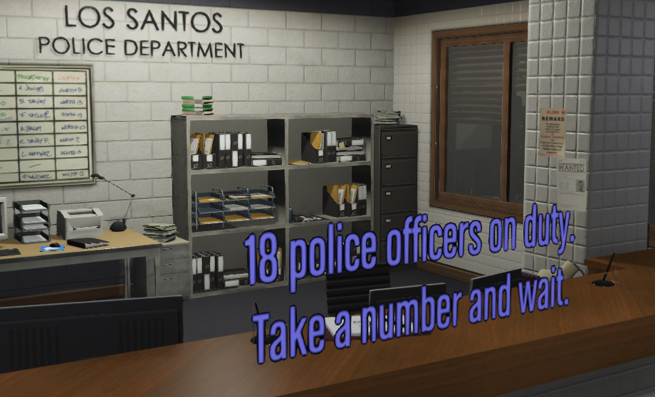
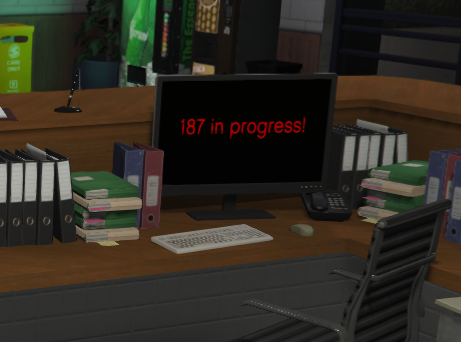

FloatyDraw
==========

What is this?
-------------

FloatyDraw is a resource to draw *whatever you want* floating in mid-air on your FiveM GTAV server.  
It was created for floating text in the style of all those DrawText3D implementations you find all over, but the idea is to make it look way better, and actually *be* 3D.

Usage
-----

To use FloatyDraw, put it in your resources directory and start it like you would any resource. In and of itself, it does nothing, but it needs to be started.

To draw floaty text in your resource, call the exported funcion as followed:
```lua
Citizen.CreateThread(function()
    local heading = 0.0
    local coords = vector3(440.801, -980.782, 30.885)
    AddTextEntry('COPS_ONLINE_WAIT', '~a~ police officers on duty.~n~Take a number and wait.')
    while true do
        local error = exports.floatydraw:FloatyDraw(coords, heading ,function(index)
            BeginTextCommandDisplayText('COPS_ONLINE_WAIT')
            SetTextFont(4)
            SetTextCentre()
            SetTextOutline()
            SetTextJustification(0)
            SetTextScale(0.9,0.9)
            AddTextComponentSubstringPlayerName('18')
            SetTextColour(100, 100, 255, 255)
            EndTextCommandDisplayText(0.5, 0.3)
        end)
        Citizen.Wait(0)
    end
end)
```

This example looks something like this:  


As you can see, this is just regular standard drawing natives. The difference is that they will be drawn on a flat "screen" hovering at `coords`, rotated to `heading`. It expects a `vector3` for the `coords`, and a `float` for the `heading`.

If something goes wrong in your little drawing function, **the error is suppressed** and ends up in the `error` variable in the example. You'll want to check if that one is a `nil` and log it or otherwise react to it.

There are some obvious problems with this example, such as it's always attempting to draw even when you're nowhere near it, and it being hideous, but I leave that sort of thing up to you to resolve.

Limitations
-----------

All this is not without it's limitations, obviously.

The biggest problem is performance. Quite a number of natives are called to make this happen, and exports are not free in themselves.  
Another major limitation is that only 19 of these can be drawn at any given moment. This is because it actually creates a prop to draw on, and there are only 19 clones of this prop available. Then there are minor limitations such as the available space on the rendering target and the fact that it's not visible from the back.

As I see it, this is very much worth it for the fact that it is a real 3D text that you can walk in front of, is not visible through walls etc etc.

Render targets
==============

Ah yes, the ability to draw directly onto prepared surfaces in GTAV! One of the most underrated features, I think!  
It's not very hard to do, either, but in this resource I've included the abstraction I use.  
It's in `rendertarget.lua`.

The function is *not* exported, so you'll have to include it in your `fxmanifest.lua` yourself, like so:

```lua
client_scripts {
    '@floatydraw/rendertarget.lua',
}
```

You also need to know the name or hash of the prop you want to draw on, and the render target texture of that prop. Not every prop has one, obviously.

Once that is all sorted, you can do something like this:
```lua
Citizen.CreateThread(function()
    local computerRT = RenderTarget(`prop_monitor_w_large`, 'tvscreen')
    AddTextEntry('COPS_ALERT', '187 in progress!')
    while true do
        computerRT(function()
            BeginTextCommandDisplayText('COPS_ALERT')
            SetTextCentre()
            SetTextJustification(0)
            SetTextColour(255, 0, 0, 255)
            EndTextCommandDisplayText(0.5, 0.3)
        end)
        Citizen.Wait(0)
    end
end)
```
It will look something like this:  


Again, this uses the same drawing natives you are used to for drawing text and sprites and whatever on the screen.

Again, there are some problems with the example, such as it always being drawn no matter what. Again, I leave it up to you to improve upon that.

Support
=======

No support is given for this resource at all. None what so ever.  
If you discover a bug, feel free to open an issue, but "How do I..." issues will be answered in documentation updates *only*, or (most likely) not at all.
